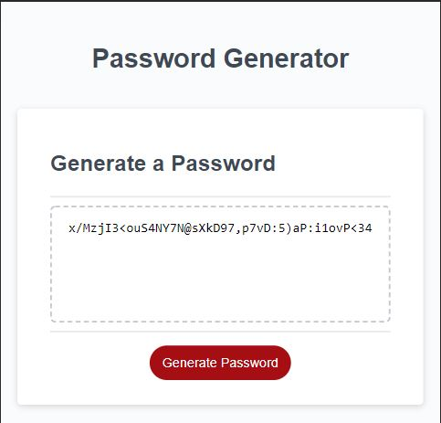

# Password Generator Starter Code

## Generating a Random Password Based on User Input #
---
### **General Info:**
The task of this project was to create an interface where the user can input certain criteria in order to generate a random strong password. The criteria for the generated passwords were to have the option to choose numeric values, special, lower, and uppercase characters. At least 1 option must be selected. The password that is created has to span from 8 characters to 128 characters; no more, no less. When all the specific criteria has been chosen, the password should then display for the user.

### **Have a Selection of Criteria That The User Can Choose**
I have included an inital prompt screen to get the amount of characters the user wants. I included "if' statements to ensure the user entered the appropriate amount of characters. If the correct amount wasn't chosen an alert window opens to let the user know what the critera is and that they need to start over by clicking the button again. After the password length selection, there is a series of confirm windows to select the type of characters the user would like to use. I included an "if" statement at the end to ensure the user chooses at least 1 of the options. Again, if they choose none of the options the code will stop running and a message will appear in a pop up screen telling the user to start over by clicking the button again. There is also a message that pops into the password box that states "try again".

### **Final Notes**
The first iteration of the code I wrote was not working. Despite reaching out to the TA's and trying to get it to work I just could not get the password to generate with the amount of characters the user selected. The TA suggested revisiting the format I chose to use and try to rework it differently. I looked at a number of sources online and what had been covered in class and on the slack threads. I decided to follow a simpler format and to wrap the entire code in a single function instead of using mulitple functions (I ran into a lot of scoping problems with that). At first I tried to use seperate functions to continue the prompts. That information was then sent to an array that captured all that data. When I tried to code a "for loop" I just couldn't get it all to work properly and return a password. 

In the new format the prompts are variables instead of functions and they continue to run on their own. I set up arrays for each character type as well. I tried to use ".String.fromCharCode" as I had in the previous version but again I could not get this to render correctly so I just typed all the characters out. When the user selects the type of characters that will be used in the password, those choices are then added together into the empty array (using the spread method) through some 'if' statements which is then looped through the 'for' loop and returned into the generated password.

### **Location:**
Website can be found at : https://mattbisbee.github.io/Password-Generator/

GitHub: https://github.com/mattbisbee/Password-Generator.git

## **Images:**

